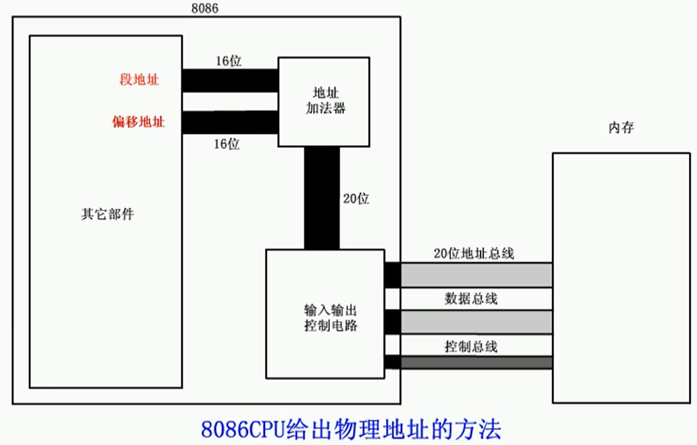
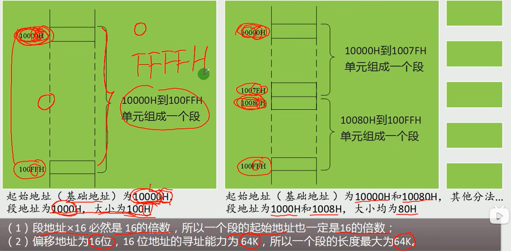
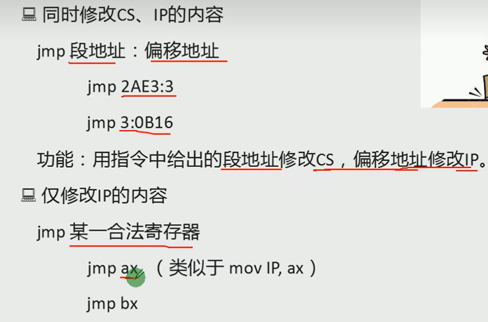
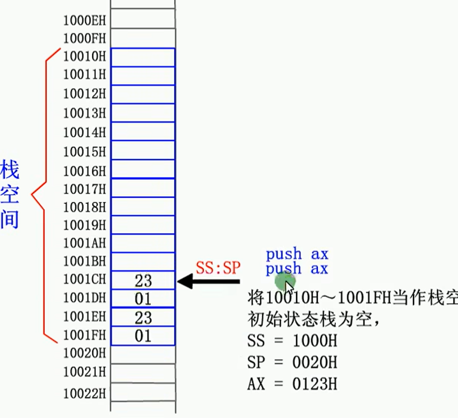
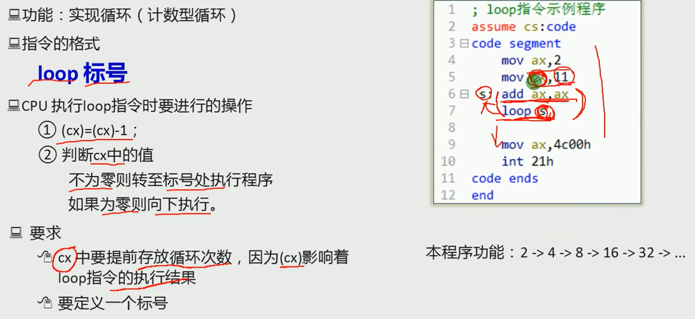
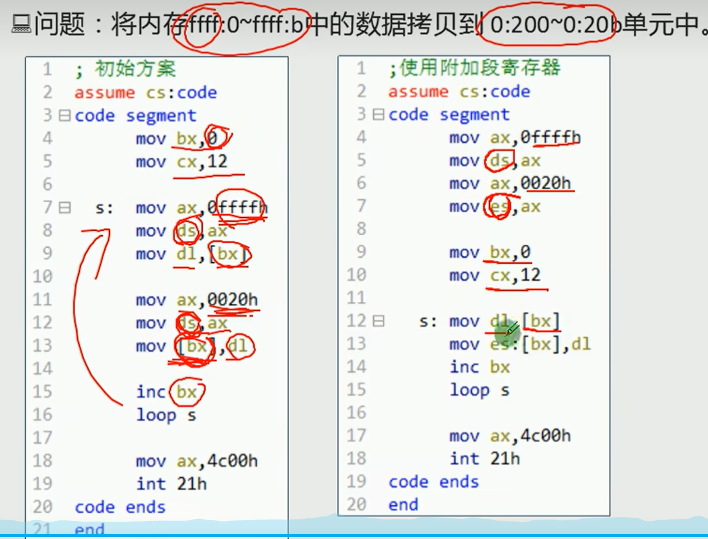
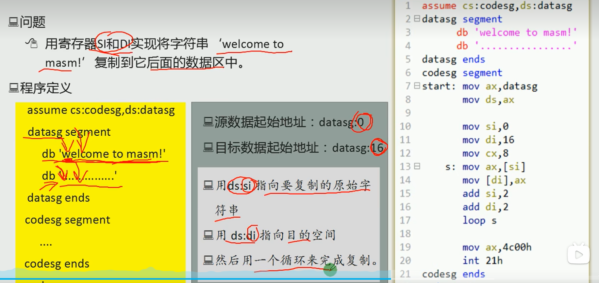

#寄存器、内存、段、mov、add、jmp

##内存地址的计算

段地址(16bit) * 16 + 偏移地址(16 bit)。 8086的地址总线是20为的因此需要两个16位的寄存器组成。

##内存分段表示地址

段是人为主观分的，计算机并不知道。物理地址就是由段地址和偏移地址合成的。

##CS指令和IP指令的作用

CS代表代码段的起始地址，IP代表代码段的偏移。通过jmp指令可以修改CS和IP的地址。

##DS和[address]

DS代表数据段，[x]代表内存地址。add ax，[0];就代表从DS段中去偏移量为x的16位数据。

##栈

SS代表栈顶的段地址，SP代表偏移地址。初始时用SP设置栈的大小，由低地址向高地址扩充。

##loop指令

用S做标记，然后判断CS寄存器的值。

##段前缀

段名：[立即数] 指定访问某个段

##DI和SI

DI为源地址寄存器SI是目的地址寄存器，都不能被分割为8位寄存器。

#转移

##offset操作符

用于计算标号的段内偏移地址

##jmp指令
段间转移： jmp 端的地址：偏移地址
段内短转移 jmp short 8位
段内近转移 jmp near  16位。相对于IP进行跳转
远转移 jmp far ptr 直接表明地址，不是相对

##jcxz

CX寄存器的值为0，跳转。

##call和ret

##rep

根据CX的值重复执行后面的指令。

##cmp指令

cmp a1 a2 直接进行相减操作，改变标志位。如果ZF=1，代表两者相等。如果CF=1，代表有借位，即a1 < a2。CF=0,则说明了无借位，但此时要注意ZF是否为0，若为0，则说明结果不为0，故此时oprd1>oprd2.

